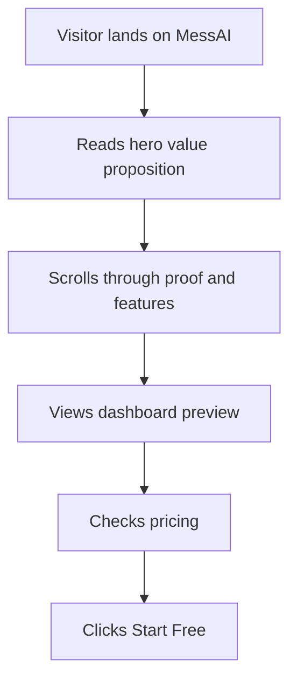

## 1. Product Overview
MessAI is an AI-powered nutrition assistant for hostel/mess students. This landing page drives sign-ups by showcasing meal scanning, dashboards, and AI insights with a distinctive “Dark Biotech Futurism” brand.

## 2. Core Features

### 2.1 User Roles
| Role | Registration Method | Core Permissions |
|------|---------------------|------------------|
| Visitor | None | Browse marketing content, view demo, start free |
| User (future) | Email/OTP | Scan meals, view dashboard, profile, history |

### 2.2 Feature Module
1. **Landing page**: navigation, hero, product proof, feature grid, dashboard preview, testimonials, pricing, final CTA, footer

### 2.3 Page Details
| Page Name | Module Name | Feature description |
|-----------|-------------|---------------------|
| Landing | Navbar | Sticky blurred header, animated underline, mobile overlay menu with staggered reveals |
| Landing | Hero | Aurora blobs + scanline overlay + grain, headline emphasis, CTA pair, micro-trust row, CSS phone mock with scan sweep and floating chips |
| Landing | Marquee | Continuous stats ticker, pauses on hover |
| Landing | Problem → Solution | Split section with dramatic divider, pain points vs fixes |
| Landing | How it works | 3-step timeline, animated dashed connector line drawing on reveal |
| Landing | Features bento | 6-card asymmetric grid with hover lift + glow; includes Recharts mini chart and chat mock |
| Landing | Live dashboard preview | Fully coded dashboard frame with charts, table, and AI insights; perspective tilt flattens on hover |
| Landing | Testimonials | 3-card grid with stars, avatars, staggered scroll reveal |
| Landing | Pricing | Free vs Pro cards, monthly/yearly toggle, “Most Popular” badge, hover sparkle feel |
| Landing | Final CTA | Large centered banner with conic-gradient animated border button and glow |
| Landing | Footer | 4-column links + social icons, subtle hover underline motion |

## 3. Core Process
Primary flow: visitor lands → understands value → explores proof/features → reviews pricing → clicks Start Free.

## 4. User Interface Design

### 4.1 Design Style
- Theme: “Dark Biotech Futurism” (tactile grain, scanlines, lab-monitor feel)
- Palette (CSS variables in :root):
  - Background: #050608
  - Surface: #0D0F12
  - Border: #1A1D23
  - Primary: #00FF94
  - Secondary: #FF6B35
  - Accent: #5B8CFF
  - Text Primary: #F0F2F5
  - Text Muted: #6B7280
- Typography:
  - Hero: Syne 800 (tight tracking)
  - Body/UI: Cabinet Grotesk (400/500/700) with sensible fallbacks
- Motion and signature effects:
  - Grain overlay (animated)
  - Aurora background blobs drifting
  - Scanline overlay in hero
  - Card border glow default + stronger hover glow
  - Cursor-follow radial glow
  - Scroll reveal via IntersectionObserver + staggered children
  - Count-up animation for stats upon reveal
  - Floating nutrition chips with bob animation

### 4.2 Page Design Overview
| Page Name | Module Name | UI Elements |
|-----------|-------------|-------------|
| Landing | Global | Consistent spacing scale, strong contrast, focus-visible rings, motion respecting prefers-reduced-motion |
| Landing | Cards | Subtle border + glow + hover lift, dense but readable typography |
| Landing | Charts | Dark tooltips, gradients, accessible color contrast and labels |

### 4.3 Responsiveness
- Desktop-first layout; stack multi-column sections below 768px
- Mobile navbar uses hamburger → full-screen overlay menu
- Charts and dashboard preview reflow to single column on mobile
