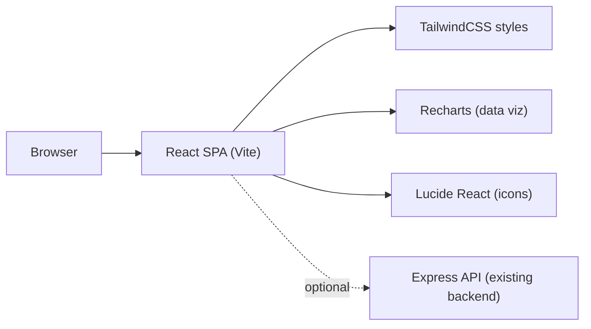

## 1. Architecture Design

## 2. Technology Description
- Frontend: React@18 + TypeScript (Vite) + tailwindcss@3
- Charts: Recharts (for dashboard previews)
- Icons: lucide-react
- Backend: Existing Express server in /workspace/backend (optional integration later)

## 3. Route Definitions
| Route | Purpose |
|-------|---------|
| / | Single-page SaaS landing experience (all sections) |

## 4. API Definitions (optional, future)
Landing page is static and does not require an API. If later expanded into the product app, the frontend can call:
- GET /health
- GET /tracker
- POST /set-user
- POST /track

## 5. Frontend Structure
| Path | Purpose |
|------|---------|
| src/App.tsx | Default export of the landing page component (single file) |
| src/main.tsx | React bootstrap |
| src/index.css | Tailwind base + CSS variables + global effects (or in-component <style> as required) |

## 6. Non-Functional Requirements
- Accessibility: keyboard navigation, focus-visible states, sufficient contrast, reduced-motion support
- Performance: CSS-first effects; avoid large images; keep JS observers scoped and disconnected on unmount
- Responsiveness: breakpoint at 768px for major layout shifts
